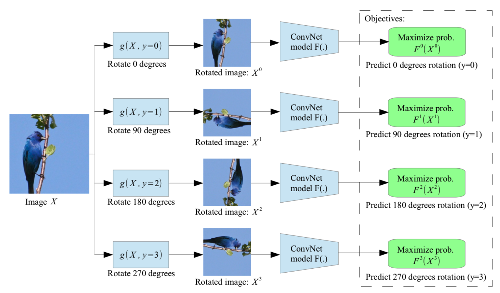
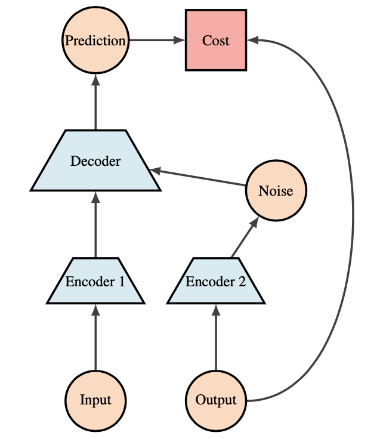
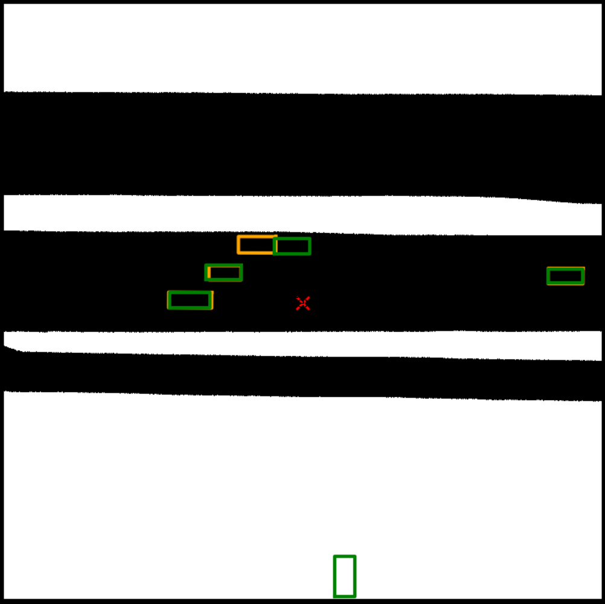

# DLSP20-final-project

## How to run the code:

Change directory (`cd`) into the folder, then type:


```

conda env create -f pdl.yml

source activate pDL

```

Then we can simply run the scripts (for example UnetLite for Bounding Box prediction) as follows:

```

python CNN-UNET-BB-200.py

```

The python scripts of interest are: 
1. CNN-VAE-BB.py (Bounding Box prediction)
2. CNN-VAE-Road.py (Roadmap prediction)
3. CNN-UNET-Road-200.py (Roadmap prediction)
4. CNN-UNET-BB-200.py (Bounding Box prediction)
5. LEARNROT-CNNVAE.py (Rotation learning for VAE)
6. LearnRot-Unet-200.py (Rotation learning for Unet)


## Self Supervised Road Map Prediction and Vehicle Detection

Convolution neural networks have leveraged large datasets of millions of labeled examples to learn rich, high-performance visual representations. However, they fail to take advantage of the potentially hundreds of billions of images available on the internet. To avoid time-consuming and expensive data annotations, many self-supervised methods have been proposed to learn visual features from large-scale unlabeled images or videos. To learn visual features from unlabeled data, a common strategy is to propose pretext tasks for networks to solve. The networks can be trained by learning objective functions of the pretext tasks, and the features are learned through this process. Various pretext tasks have been proposed for self-supervised learning including image rotations, colorizing grayscale images, image inpainting, image jigsaw puzzles, etc.
The pretext tasks share two common properties: (1) visual features of images or videos need to be captured by Convolution Neural Nets to solve the pretext tasks, (2) pseudo labels for the pretext task can be automatically generated based on the attributes of images or videos.

Our paper aims to provide a similar “self-supervised” formulation for identifying the binary road-map and detecting vehicles using images captured by six different cameras attached to the same car to generate a top down view of the surrounding area: We initially create a representation from unlabelled images using various methods and then use this for supervised prediction. The data used for this project consists of:
1. Unlabeled set: Used for pre-training, this dataset consists of 106 scenes each with 126 samples
2. Labeled set: Used for both training and validation, this consists of 28 scenes each with 126 samples which were randomly split into training and validation sets based on a 90/10 split of the scenes.


###Rotation Learning

In this case the pretext task is to predict rotations of images. Each input image is randomly rotated by a multiple of $90^{\circ}$, corresponding to $[0^{\circ},90^{\circ},180^{\circ},270^{\circ}]$. The model is trained to predict which rotation has been applied, creating a 4-class classification problem. In order to identify the same image with different rotations, the model has to learn to recognize high-level, semantically meaningful concepts, such as tires, headlights and windows, and the relative positions of these parts. Once the network is trained, we can strip off the last layer and use it to generate a representation of the image. For example, in Figure \ref{fig:cnnvae} we use the weights from the Rotation Network for Encoder 1 and keep them frozen during training or fine-tune them further for the task at hand.

###GANs

Generative adversarial networks (GANs) are able to learn to map from simple latent variables to arbitrarily complex data distributions. Studies have shown that the latent space of such generative models captures semantic variation in the data; e.g. when training GAN models on human faces, some latent variables are associated with facial expression, glasses, gender, etc. We trained a DCGAN on the unlabelled data and then use a latent representation generated by the Discriminator as the input to our supervised learning model. 

{: width=150 height=150 style="float:right; padding:16px"}

###Semantic Segmentation

Semantic segmentation is the task of classifying each and every pixel in an image as one of multiple pre-defined classes. This is especially useful for self driving cars which may need to know exactly where another car is on the road or the location of a human crossing the road. Convolutional networks by themselves, trained end-to-end, pixels-to-pixels, can achieve great results towards this end, especially when used in a self-supervised fashion.

###Object Detection

Unlike semantic segmentation, object detection seeks to identify discrete instances of each class, usually by drawing and labeling a ``bounding box" around each object in an image. Object detection methods generate proposal regions that are likely to contain objects, and then evaluate those regions with a convolutional neural network to determine which actually do contain an object and the type of object they contain. These methods also predict adjustments to the dimensions of the proposed region, to more perfectly bound the object. Lastly, these methods use non-maximum suppression to pick the best bounding boxes, since multiple proposal regions can bound the same object. 

Two major frameworks for object detection are R-CNN and its variants, and single-shot methods like YOLO (``you only look once"). In the former, region proposals are generated at the sample level, either in a fixed way from a region proposal algorithm or learned from the training data . These regions are evaluated independently. In the latter, a fixed grid of canonical regions are implicitly proposed (though their shapes can be tuned before training with k-means clustering). These regions are all evaluated simultaneously with a single fully-convolutional network.

##Methodology
We tried two approaches for detecting the binary road-maps using Semantic Segmentation: 
1. CNN-VAE
2. UNetLite
These can easily be extended to bounding box detection as well. For bounding box detection we chose to fit a YOLO model.

###CNN-VAE for Semantic Segmentation

In one approach we use a convolution encoder decoder structure with a variational component. This is mostly comprised of convolution layers, followed by max pooling and batch norm layers, which then gets encoded into a vector representation. In addition, we apply convolutions to the output to estimate $\mathbb{E}(z)$ and $\mathbb{V}(z)$ and sample $\epsilon \sim \mathcal{N}(0,1)$ to get a representation for the hidden later with $\mathbb{E}(z) + \epsilon \mathbb{V}(z)$. These representations for each image and the latent space are then concatenated and then input to the decoder, which is comprised of transposed convolution and batch normalization layers, to return a $800 \times 800$ binary map.



###UNET for Semantic Segmentation

The UNET \cite{unet} architecture contains a downward path followed by an upward path comprised entirely of convolution layers. The downward ``encoder" path consists of a stack of Convolutional and max pooling layers. The upward ``decoder" path expands the representation and enable precise localization using upsampling. After a few levels of upsampling, and once the U-structure has been completed, we merge the six separate images together, upsample for a few additional layers and map them onto the $800 \times 800$ binary map. Due to hardware limitations, we used a much smaller number of channels than the original paper, replacing 64, 128, 256, 512 and 1024 channels with 16, 32, 64, 96 and 128 channels respectively.

This architecture can also be used to get the bounding box coordinates for vehicle detection (though we used YOLO for this task in our submissions). We convert the bounding box coordinates to an $800 \times 800$ binary map and then train the network just as described before. The loss function, $L$, used is a weighted sum of the weighted Binary Cross Entropy loss, $L_{BCE}$, 

\begin{align*}
    L_{BCE} &= \frac{1}{N}\sum_n w_1 r_n \log p_n + w_0 (1-r_n) \log (1-p_n)
\end{align*}
and the IoU loss, $L_{IoU}$ \cite{iou}:
\begin{align*}
    L_{IoU} &= 1 - \frac{I(R)}{U(R)} \\
    &= 1 - \frac{\sum_{n} p_n r_n}{\sum_{n} p_n +  r_n - p_n * r_n}
\end{align*}
or the Dice loss, $L_{DICE}$:
\begin{align*}
    L_{DICE} &= 1 - 2 \frac{\sum_l w_l \sum_n p_n r_n}{\sum_l w_l \sum_n p_n + r_n}
\end{align*}

where $R$ is the reference foreground segmentation with $r_n$ denoting the true labels for pixel $n$ while $P$ denotes the predicted probabilistic map with $p_n$ the predicted probabilities for pixel $n$. Then the total loss is $L = \alpha L_{BCE} + (1 - \alpha) L_{IoU}$ or $L = \alpha L_{BCE} + (1 - \alpha) L_{DICE}$, but the $IoU$ loss performed better on the test set. The choices for $\alpha$ and $w_l$ were determined by the severity of the class imbalance problem, which is why we settled on $\alpha=0.25$ for the binary roadmap problem and $\alpha=0.1$ for the bounding box problem after trying several different values for each problem whereas as $w_l \propto f(n_l)^{-1}$ for some increasing function $f(.)$. We also tried training a dual segmentation model that performs both tasks at the same time, but this didn't perform as well. We trained for 25 epochs using the Adam optimizer with an initial step-size of $0.0003$ and used $\texttt{ReduceLROnPlateau}$ to reduce learning rate if the validation loss didn't decline in 5 epochs. In addition, the weights for the Convolution layers were initialized using Xavier initialization. 

###YOLO for object detection
We train the most recent iteration of YOLO, called YOLOv3, on the labeled data to detect vehicles and pedestrians, using the publicly available Western Digital implementation with pre-trained weights erased. YOLOv3 is a fully convolutional network, meaning all of its weights are from convolutional layers. Non-parametrized layers include batch norm and residual connections. For each canonical bounding box over a course grid of the input image, the model predicts vertical and horizontal offsets and scaling, the probability that the box contains an object, and the conditional probability that the object is each of the $C$ classes, for a total of $5+C$ predictions. 
The loss is a linear combination of the mean squared error on the four box coordinates (center x, center y, width, and height) and cross entropy losses on the $1+C$ predicted probabilities. Since the target bounding boxes are not necessarily axis aligned, we alter them to be the smallest axis-aligned box that completely encloses the true target. We use the Adam optimizer with a learning rate of 0.001. During inference, the predictions are filtered based on an object probability threshold. The remaining predictions are grouped by class, ordered by object probability, and filtered to discard boxes that overlap too much with higher-prediction boxes, in a process called non-maximum suppression. 

##Results and Summary
For the rotation learning task the model learns very fast and achieves almost $100\%$ accuracy by the $3^{\text{rd}}$ epoch, but we train it for another 10 epochs in the hopes that it learns a richer representation. We then transfer these weights onto the Image Encoders for our models and compare how the models perform when we keep these layers frozen as opposed to fine-tuning them for the Semantic Segmentation tasks. Table 1 illustrates the performance of the various models on a hold-out test set. For the purely supersized approaches, both models perform about the same for the Binary Road map prediction although the UNet approach performs much better for the bounding box prediction task. However, while the performance of the CNN-VAE improves with the use of self-supervised representations, we see a decline in the performance of the UNet model. 

\begin{table}[h]
\begin{center}
\scalebox{0.6}{%
\begin{tabular}{|| c || c | c |c || c | c |c ||}
\hline
\hline
& \multicolumn{3}{ |c|| }{Roadmap} & \multicolumn{3}{ |c|| }{Bounding-Box}\\
\hline
Self-Supervised & CNN-VAE & UNetLite & Yolo & CNN-VAE & UNetLite & Yolo \\
\hline
No  & 0.56 & \textbf{0.67}* & $\times$ & 0.000 & \textbf{0.009} & 0.002* \\
Frozen Encoder & 0.64& 0.53&$\times$ & 0.000& 0.007 & $\times$ \\
Fine-tuned Encoder & 0.64& 0.53& $\times$ & 0.000 & 0.007 & $\times$ \\
\hline
\hline
\end{tabular}}
\caption{Comparison of methods in terms of optimal threat scores. Except for YOLO and UNetLite, where the estimates are based on the actual test set, all other estimates are based on a a random 90/10 split of the scenes. The top performing methods, as indicated in \textbf{bold}, was UNetLite for the binary Roadmap and the Bounding Box prediction. Comparisons between the self-supervised UNetLite model and the regular UNetLite model is perhaps an unfair comparison as they were trained under slightly different conditions. In similar conditions, the threat score for UNetLite was 0.56.}
\label{tab:results}
\end{center}
\end{table}

The object detection models achieves an average threat score of 0.1088 on the training set. Attempts to fit the model on a smaller training set for hyperparameter tuning and performance evaluation were unsuccessful. Minor variants on our standard YOLO approach were also unsuccessful. These include rotating the input image to align with the birds-eye view target image, and altering the loss function to prioritize detection and bounding over class identification.
{: width=150 height=150 style="float:right; padding:16px"}

##Conclusion and Future Work

Our methods achieved a threat score of $0.67$ for Binary Roadmap prediction and $0.009$ for the Bounding Box prediction. There is still much room for improvement for both tasks. Time and computation resources were a severe constraint on both the number of experiments as well as the size of each experiment we could conduct. One way to improve the road segmentation model is to try deeper models with more features over a longer period of time. For example, we would like to train for more than 25 epochs and we would also like to train the full UNet model instead of a the UNetLite model we used. In addition, there is room for improvement in the self-supervised part. One approach that we could take here is to train a multi-task model to jointly predict multiple pretext tasks such as colorization, inpainting and jigsaw puzzles to see if that improves the quality of the representations learnt by the model.  To improve the object detection YOLO implementation, we would try to alter the initial convolutional layers to take our input size as the default, and also add fully-connected layers to help learn the translation from camera view to bird's-eye view. We also saw some promising returns on using UNet for bounding boxes towards the end of the project, after we had settled on the YOLO implementation. We would like to compare those approaches further.